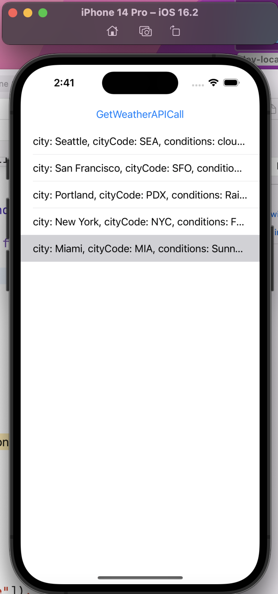
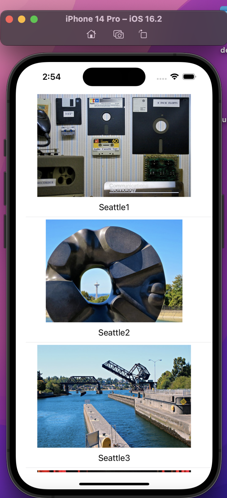
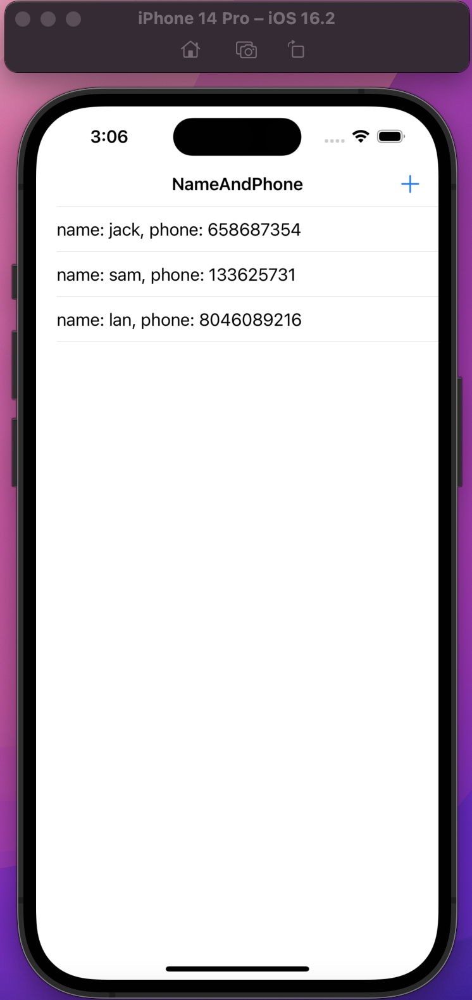
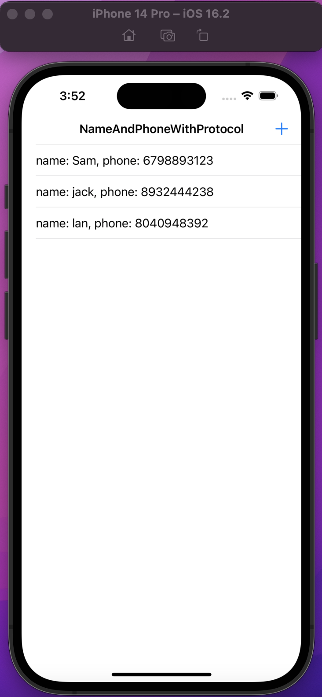

# INFO6350 Final
______
## Question01
Create an app which will display weather in a table view by making API call at https://us-central1-fir-api-s-8d31b.cloudfunctions.net/app  

## Question02
Create an app which will show images from Seattle in a table view which is scrollable  

## Question03
Create an app which will have a Table view, and a navigation controller and a bar button item on the controller. When you click on the bar button item it will open an alert controller. You will collect Name, Phone number from the user and then add this on the4 table view.   

## Question04
Create the same app as 3 but get the values from a different VC, once the name and phone number is added in the Second VC use protocol and delegate to get the values the Name and Phone number put it in the table vc for the first VC.  

